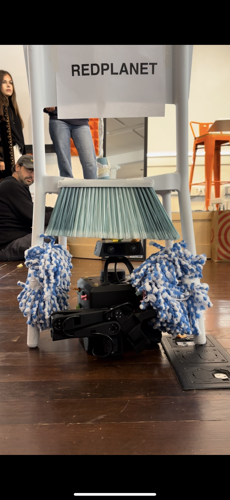

# Red Planet Cleaning Station



An autonomous self-reflective correction demo for MARS robots — the robot looks in a mirror, notices it's dirty, narrates what it sees, and drives itself through a brush station to clean up.

Built on Innate's Rosbridge v2.0 WebSocket stack over ROS2.

---

## The Demo

The robot executes a closed-loop self-awareness sequence with no pre-scripted dialogue:

1. **Turns to face a mirror** — spins 90° right
2. **Looks at itself** — takes a photo through its main camera
3. **Reflects** — Claude analyzes the image and generates context-aware speech describing what it actually sees (dirt, obstructions, sticky notes)
4. **Declares intent** — "Let me clean up."
5. **Turns to the brush station** — spins 180° to face the chair with brushes in its legs
6. **Confirms the path** — takes another photo, verifies the station is ahead
7. **Drives through** — slow pass through the brush "car wash"
8. **Verifies the result** — turns back to the mirror, takes an after photo, reacts

Nothing the robot says is canned. Every line of speech is generated from what the camera actually sees.

```bash
bun run src/demo-self-clean.ts 172.17.30.145
```

---

## Architecture

```
Claude (decides what to do + generates speech from vision)
    ↓ JSON-over-WebSocket (port 9090)
rosbridge_server (on Jetson)
    ↓
skills_action_server ← Innate's Python skill pipeline
    ↓
ManipulationInterface / MobilityInterface / HeadInterface
    ↓
MoveIt, Nav2, servo drivers, hardware
```

- `src/rosbridge-client.ts` — Core WebSocket client (topics, services, actions)
- `src/mars-topics.ts` — Typed topic/service/message constants
- `src/repl.ts` — Interactive REPL for live robot control
- `src/validate.ts` — Incremental validation tests (1–7)
- `src/demo-self-clean.ts` — The cleaning station demo sequence
- `src/plans/self-reflective-clean.md` — Vision-driven plan spec
- `web/` — Next.js frontend for browser-based control
- `skills/mars-robot-control/` — Reusable robot control skill + references

---

## Setup

```bash
bun install
```

Connect to the robot over the same network. Default IP: `172.17.30.145`, Rosbridge port: `9090`.

```bash
# Validate the connection before running the demo
bun run src/validate.ts 172.17.30.145 1   # connection + discovery
bun run src/validate.ts 172.17.30.145 2   # head emotion (safest)
bun run src/validate.ts 172.17.30.145 3   # GotoJS no-op
```

---

## Direct Robot Control

```bash
bun run skills/mars-robot-control/scripts/robot-cmd.ts <robot-ip> <command> [args]
```

| Command | Example | What it does |
|---------|---------|-------------|
| `speak` | `speak Hello world` | Text-to-speech |
| `photo` | `photo main` | Capture a JPEG from the main camera |
| `skill` | `skill innate-os/head_emotion {"emotion":"happy"}` | Execute any skill |
| `head` | `head 15` | Tilt head (−25 to 25°) |
| `emotion` | `emotion excited 2` | Head emotion with repeat |
| `drive` | `drive 0.15 0 3` | Drive for N seconds |
| `spin` | `spin 90` | Spin N degrees (positive = left) |
| `arm` | `arm 0.25 0 0.3` | Move arm to XYZ |
| `goto_js` | `goto_js 0 -0.5 1.5 -1 0 0 2` | Move arm to joint positions |
| `joints` | `joints` | Read current arm joints |
| `torque` | `torque off` | Enable/disable arm servos |
| `status` | `status` | Battery, arm, position, head |
| `stop` | `stop` | Emergency stop |

---

## Interactive REPL

```bash
bun run src/repl.ts 172.17.30.145
```

---

## Robot Connection

- Default IP: `172.17.30.145`
- Rosbridge: port `9090`
- SSH: `ssh jetson1@<ip>` (password: `goodbot`)
- Speed caps: 0.3 m/s linear, 1.0 rad/s angular
